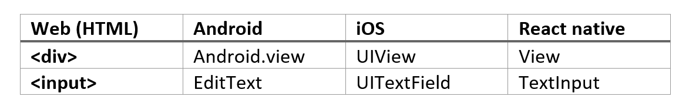

# What is react native?

https://reactnative.dev/

react native -> Real native mobile apps (ios, android).

#### Prequisits:

1. HTML + CSS
2. JavaScript
3. Install NodeJS
4. React knowledge is advantage.

#### react.js

- A js library for building UI's
- React usually is used with web development.
- React.Dom.Render(...) : adds the web support. We can instead render data to anywhere else.

#### react native

- A collection of `special` react components. (View, Text)
- components are compiled to native widgets.
- Gives access to native platform API's exposed to JS. (camera, location etc..).

##### 4 ways to get native apps using react:

1. React for the web.
2. Native components (Andorid)
3. Native components (iOS)
4. React native

For example:

## Notes about react native:

- In react native we must write flexible code (to fit all the platforms).
- There are not many basic components.
- Most components don't come with a lot of styling.
- New versions are always coming out.
- high dependency on third-party packages (they change!) -> happens less in Expo.

## Other options:

- Built real native apps:

  - Android studio + Java (android)
  - ObjectiveC + swift (ios)

- Built progressive web app:

  - Disadvantage: users will not use a browser, or the os will not support it.

- Use ionic or other technology (cordova):
  - worse preformance. (slower, more weight).

* There is also a use of: Flutter and Dart.
