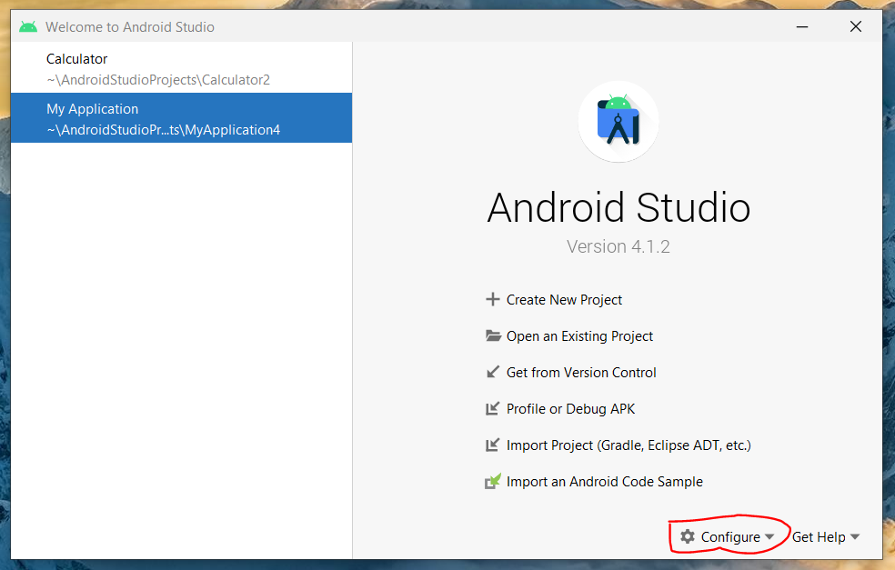
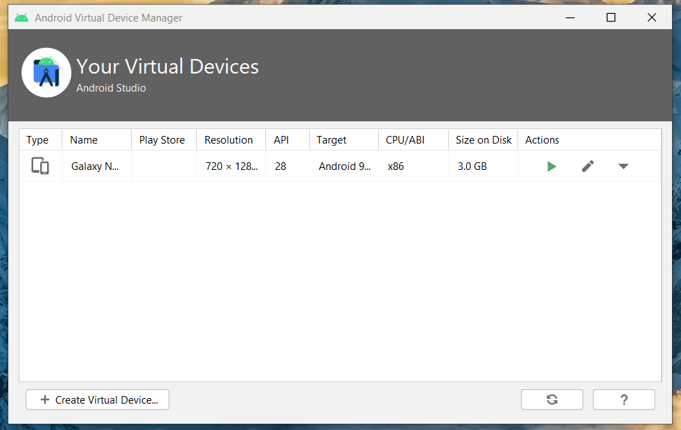
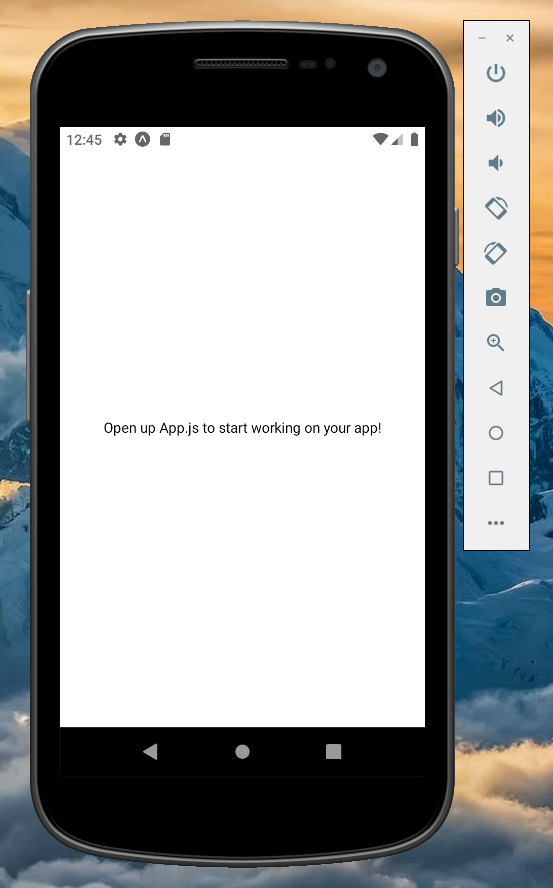

#### We have 3 ways to see our app:

### 1. Connect to phone:

- in your phone - download **Expo Go** (google play).

* use the app scanner to scan the barcode.

* In the end: you should see:

```
Open up App.js to start working on your app!
```

### 2. Open in browser:

we can open the app in the browser. (good for debugging, etc..)

- in Metro bundler: click on `Run in web browser`.

### 3. Open in Android emulator:

- Open android studio -> Configure -> AVD Manager.

* pick a device and run it.




- run the app: write `a` (shortcut for android) on cmd, or through the web.
  
