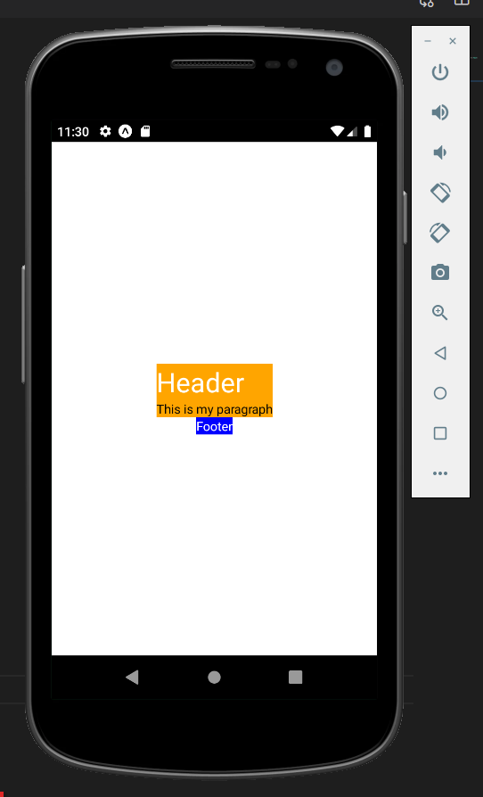

## View

View - is a container. This is the most basic component for building UI's. 
* View - supports flexbox, style, touch handling. 
* View is similar to div in the web. 
* View takes only the space the child components need. (Not the fullscreen). 
* View (unlike div) - cannot have plain text inside. (text must be wrapped with `<Text></Text>` component). 

```js
export default function App() {
// Error!!!
  return (
    <View style={styles.container}>
      Hello world 
    </View>
  );
}
```
##### Nested Views:

```js
export default function App() {
  return (
    <View style={styles.container}>
      
      <View style={{backgroundColor:"orange"}}>
        <Text style={{fontSize:30, color:"white"}}>Header</Text>
        <Text>This is my paragraph</Text>
      </View>

      <View style={{backgroundColor:"blue"}}>
        <Text style={{color:"white"}}>Footer</Text>     
      </View>
    </View>
  );
}
```
