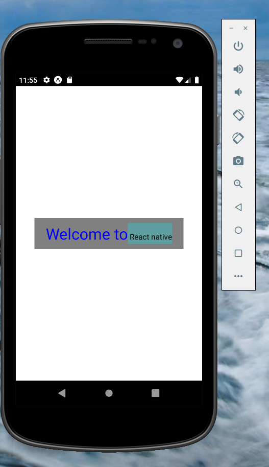

## Text

* Text is the react native component for displaying text. (both for Android and iOS). 

* Here we created 2 texts inside the view component(screen). 
* width - gets all the space from the father component. (`width:80%` - takes 80% from the parent compoent's space. )

```js
import React from 'react';
import { StyleSheet, Text, View } from 'react-native';

export default function App() {
  return (
    <View style={styles.container}>
      <Text style={styles.header}>Hello new user</Text>
      <Text style={styles.text}>Welcome to the greatest app in the world</Text>
    </View>
  );
}

const styles = StyleSheet.create({
  container: {
    flex: 1,
    backgroundColor: '#fff',
    alignItems: 'center',
    justifyContent: 'center',
  },
  header:{
    textAlign:"center",
    width:"80%",
    color:"blue",
    fontSize:30,
    padding:10,
    backgroundColor:'gray'
  },
  text:{
    textAlign:"center",
    color:"cadetblue",
    fontSize:15,
    padding:10
  }
});

```

## Nested text:

* We can nest texts (add Text component inside another Text component). 
* All the style of the parent Text will be also for the child component Text, as long as we do not override it. 

```js
import React from 'react';
import { StyleSheet, Text, View } from 'react-native';

export default function App() {
  return (
    <View style={styles.container}>
      <Text style={styles.txt1}>Welcome to  
        <Text style={styles.txt2}> React native</Text>
      </Text>
    </View>
  );
}

const styles = StyleSheet.create({
  container: {
    flex: 1,
    backgroundColor: '#fff',
    alignItems: 'center',
    justifyContent: 'center',
  },
  txt1:{
    textAlign:"center",
    width:"80%",
    color:"blue",
    fontSize:30,
    padding:10,
    backgroundColor:'gray'
  },
  txt2:{
    textAlign:"center",
    color:"black",
    fontSize:15,
    padding:10,
    backgroundColor:'cadetblue'
  }
});
```


