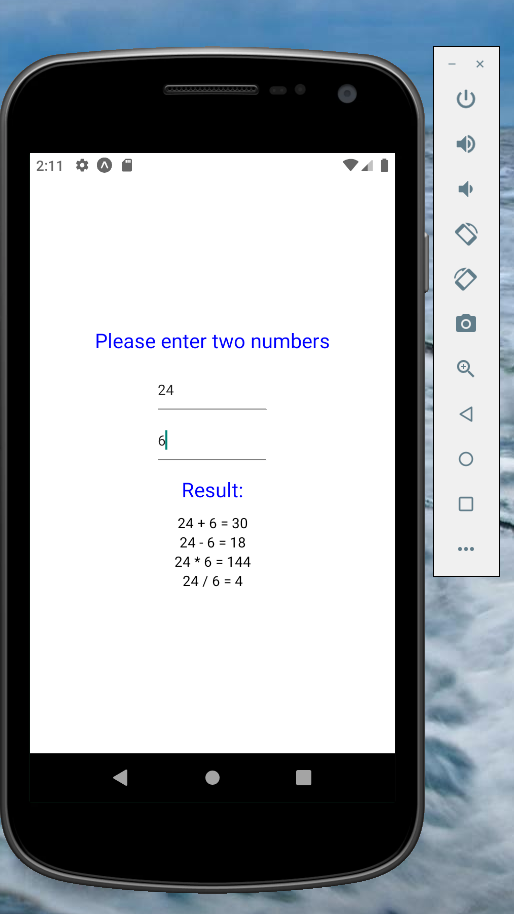

## InputText

* InputText is similar to `<input/>` in HTML. 
* InputText has no closing tag. 

### Props:
props are all the addittions to the InputText:
1. style - responsible for design
2. onChangeText - responsible for the user input. 
3. placeholder - will show a text until the user adds his text. 
4. value - insert value to the input tab. 
5. maxLength - defines the max characters the user can insert. 
6. keyboardType - we can define the keyboard type according to need. 
    * Note: There are types that specific for android or iOS.
    * For both systems: default, numeric, email-address, phone-pad. 
        * andorid: visible-password
        * iOS: url, twitter, web-search
7. autoCapitalize - define which letters will be autoCapitalize. 
    * none 
    * characters - all the characters
    * words - in the beginning of every word (example: names)
    * sentences - in the beginning of every sentence. 
8. autoCompleteType - adds words suggestions.  
```js
import React, {useState} from 'react';
import { StyleSheet,TextInput, Text, View } from 'react-native';

export default function App() {

  const [myName, setMyName] = useState("name...");

  return (
    <View style={styles.container}>
      <Text style={styles.txt1}>Enter your name:</Text>

      <TextInput 
        style={styles.input} 
        onChangeText={(txt)=>setMyName(txt)}
        placeholder="Enter your name:"
        autoCapitalize="words"
        autoCompleteType="name"
        />

      <Text>
        Your name is: {myName}
      </Text>

    </View>
  );
}

const styles = StyleSheet.create({
  container: {
    flex: 1,
    backgroundColor: '#fff',
    alignItems: 'center',
    justifyContent: 'center',
  },
  txt1:{
    fontSize:20
  },
  input:{
    borderColor:'gray',
    borderWidth:1,
    height:40,
    width:"50%"
  }
});
```


## Calculator:



* App.js
```js
import React, {useState} from 'react';
import { StyleSheet,TextInput, Text, View } from 'react-native';

export default function App() {

  const [num1, setNum1] = useState(0);
  const [num2, setNum2] = useState(0);

  return (
    <View style={styles.container}>
      <Text style={styles.txt1}>Please enter two numbers</Text>
        <TextInput style={styles.input}
          placeholder="enter num1"
          onChangeText={(num1)=>setNum1(Number(num1))}
          maxLength={3}
          keyboardType="numeric"
          />
        <TextInput style={styles.input}
          placeholder="enter num2"
          onChangeText={(num2)=>setNum2(Number(num2))}
          maxLength={3}
          keyboardType="numeric"
        />

          <Text style={styles.txt1}>Result:</Text>
          <Text>{num1} + {num2} = {num1 + num2}</Text>
          <Text>{num1} - {num2} = {num1 - num2}</Text>
          <Text>{num1} * {num2} = {num1 * num2}</Text>
          <Text>{num1} / {num2} = {num1 / num2}</Text>

    </View>
  );
}

const styles = StyleSheet.create({
  container: {
    flex: 1,
    backgroundColor: '#fff',
    alignItems: 'center',
    justifyContent: 'center',
    display:'flex',
    flexDirection:'column'
  },
  txt1:{
    fontSize:20,
    width:"80%",
    color:"blue",
    textAlign:'center',
    margin:10
  },
  input:{
    borderColor:'white',
    borderBottomColor:'gray',
    borderWidth:1,
    height:40,
    width:"30%",
    margin:5
  },
});

```