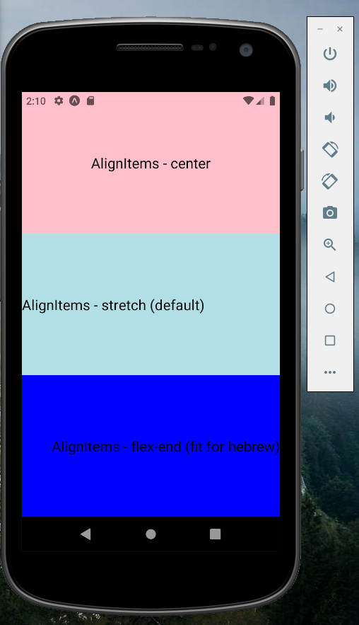

# Flexbox

- Flexbox is designed to provide constant layout to diffrent sizes.
- In the web - the default flexbox is in a row.

For more styling options: https://yogalayout.com/

### flex

`Flex` will define how elements will fill the space.

- For example:
  We have here 3 elements. 1 + 2 + 3 = 6.

All the page will be divided to 6 blocks.

Each element will take his space: for example 1/6, 2/6, 3/6.

```js
import React from "react";
import { StyleSheet, TextInput, View, Text } from "react-native";

export default function App() {
  return (
    <View style={styles.container}>
      <View style={{ flex: 1, backgroundColor: "blue" }}></View>
      <View style={{ flex: 2, backgroundColor: "gray" }}></View>
      <View style={{ flex: 3, backgroundColor: "black" }}></View>
    </View>
  );
}

const styles = StyleSheet.create({
  container: {
    flex: 1,
  },
});
```


### flexDirection

- In react-native - the default flexbox is in a column.
- if flex-direction is row - all the elements will be next to each other. (not under each other).

```js
import React from "react";
import { StyleSheet, TextInput, View, Text } from "react-native";

export default function App() {
  return (
    <View style={{ padding: 50, flexDirection: "row" }}>
      <View
        style={{
          backgroundColor: "red",
          width: "100%",
          height: 100,
          justifyContent: "center",
          alignItems: "center",
        }}
      >
        <Text>First box</Text>
      </View>

      <View
        style={{
          backgroundColor: "orange",
          width: 100,
          height: 100,
          justifyContent: "center",
          alignItems: "center",
        }}
      >
        <Text>Second box</Text>
      </View>

      <View
        style={{
          backgroundColor: "yellow",
          width: 100,
          height: "50%",
          justifyContent: "center",
          alignItems: "center",
        }}
      >
        <Text>Third box</Text>
      </View>
    </View>
  );
}

const styles = StyleSheet.create({});
```


### JustifyContent

`JustifyContent` define how elements will be presented - in direction of `up` and `down`.

```js
import React from "react";
import { StyleSheet, TextInput, View, Text } from "react-native";

export default function App() {
  return (
    <View style={styles.container}>
      <View style={styles.container1}>
        <Text style={styles.txt1}>justifyContent - center</Text>
      </View>

      <View style={styles.container2}>
        <Text style={styles.txt1}>justifyContent - flex-start</Text>
      </View>

      <View style={styles.container3}>
        <Text style={styles.txt1}>justifyContent - flex-end</Text>
      </View>
    </View>
  );
}

const styles = StyleSheet.create({
  container: {
    flex: 1,
    justifyContent: "center",
  },
  container1: {
    flex: 1,
    justifyContent: "center",
    backgroundColor: "green",
  },
  container2: {
    flex: 1,
    justifyContent: "flex-start",
    backgroundColor: "yellow",
  },
  container3: {
    flex: 1,
    justifyContent: "flex-end",
    backgroundColor: "red",
  },
  txt1: {
    fontSize: 20,
  },
});
```


### AlignItems

- Goes from right to left.
- stretch is the default.

- flex-end fit for hebrew.

```js
import React from "react";
import { StyleSheet, TextInput, View, Text } from "react-native";

export default function App() {
  return (
    <View style={styles.container}>
      <View style={styles.container1}>
        <Text style={styles.txt1}>AlignItems - center</Text>
      </View>

      <View style={styles.container2}>
        <Text style={styles.txt1}>AlignItems - stretch (default)</Text>
      </View>

      <View style={styles.container3}>
        <Text style={styles.txt1}>AlignItems - flex-end (fit for hebrew)</Text>
      </View>
    </View>
  );
}

const styles = StyleSheet.create({
  container: {
    flex: 1,
    justifyContent: "center",
  },
  container1: {
    flex: 1,
    backgroundColor: "pink",
    justifyContent: "center",
    alignItems: "center",
  },
  container2: {
    flex: 1,
    backgroundColor: "powderblue",
    justifyContent: "center",
    alignItems: "stretch",
  },
  container3: {
    flex: 1,
    backgroundColor: "blue",
    justifyContent: "center",
    alignItems: "flex-end",
  },
  txt1: {
    fontSize: 20,
  },
});
```



### Width and height:

- `auto` - default. each element gets his space as needed.
- `pixels` - 100, 60, etc... (write as a number)
- `precentages` - define the elements width and height by `%`. (write as a string).
