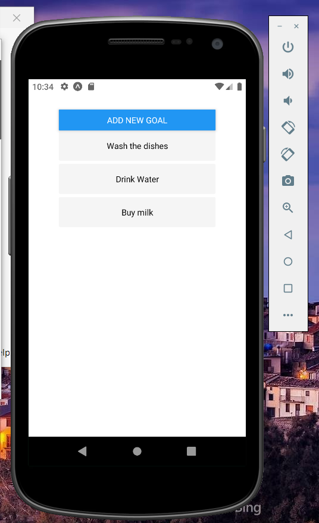
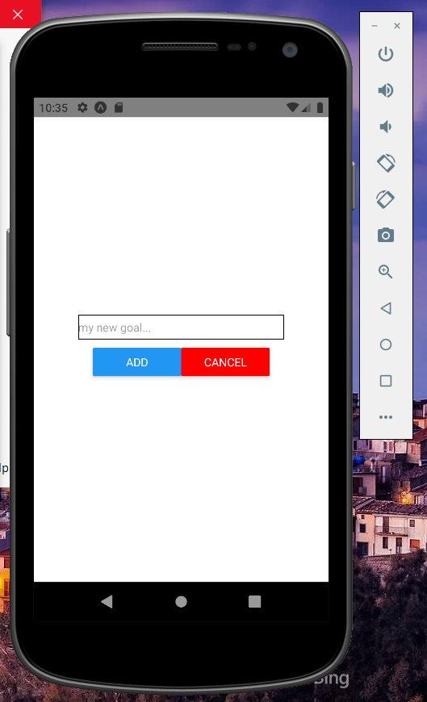

# Modal

Modal component is react-native component to present content above a View.

### Props

- visible - true/false
- animationType - slide, fade, none.

### Final app:




##### GoalItem.js

```js
import React from "react";
import { View, Text, StyleSheet, TouchableOpacity } from "react-native";

const GoalItem = (props) => {
  return (
    <TouchableOpacity
      activeOpacity={0.5}
      onPress={props.onDelete.bind(this, props.id)}
    >
      <View style={styles.listItem}>
        <Text>{props.title}</Text>
      </View>
    </TouchableOpacity>
  );
};

const styles = StyleSheet.create({
  listItem: {
    marginBottom: 5,
    backgroundColor: "whitesmoke",
    justifyContent: "center",
    alignItems: "center",
    minHeight: 50,
    minWidth: "100%",
    borderRadius: 3,
  },
});

export default GoalItem;
```

##### GoalInput.js

```js
import React, { useState } from "react";
// import Modal
import { View, StyleSheet, TextInput, Button, Modal } from "react-native";

const GoalInput = (props) => {
  const [goal, setGoal] = useState("");

  return (
    <Modal visible={props.visible} animationType="none">
      <View style={styles.inputContainer}>
        <TextInput
          style={styles.input}
          placeholder="my new goal..."
          onChangeText={(txt) => setGoal(txt)}
        />
        <View style={styles.btnContainer}>
          <View style={styles.btn}>
            <Button title="Add" onPress={props.onAddGoal.bind(this, goal)} />
          </View>
          <View style={styles.btn}>
            <Button title="Cancel" onPress={props.onCancel} color="red" />
          </View>
        </View>
      </View>
    </Modal>
  );
};

const styles = StyleSheet.create({
  inputContainer: {
    justifyContent: "center",
    alignItems: "center",
    flex: 1,
  },
  input: {
    borderColor: "black",
    borderWidth: 1,
    width: "70%",
  },
  btn: {
    width: "50%",
  },
  btnContainer: {
    flexDirection: "row",
    width: "60%",
    margin: 10,
  },
});

export default GoalInput;
```

##### App.js

```js
import React, { useState } from "react";
import { StyleSheet, View, FlatList, Button, Text } from "react-native";

import GoalInput from "./GoalInput";
import GoalItem from "./GoalItem";

export default function App() {
  const [goalList, setGoalList] = useState([]);

  // Show adding-item when user clicks the button
  const [isAdd, setIsAdd] = useState(false);

  const addGoalHandler = (goal) => {
    setGoalList((currentGoals) => [
      ...currentGoals,
      { id: Math.random().toString(), value: goal },
    ]);
    cancelGoalHandler();
  };

  const removeGoalHandler = (goalId) => {
    setGoalList((currentGoals) =>
      currentGoals.filter((goal) => goal.id !== goalId)
    );
  };

  // Remove modal
  const cancelGoalHandler = () => {
    setIsAdd(false);
  };

  // Add a button for new goal
  return (
    <View style={styles.container}>
      <Button title="Add new Goal" onPress={() => setIsAdd(true)} />

      <GoalInput
        onAddGoal={addGoalHandler}
        onCancel={cancelGoalHandler}
        visible={isAdd}
      />
      <FlatList
        keyExtractor={(item) => item.id}
        data={goalList}
        renderItem={(item) => (
          <GoalItem
            title={item.item.value}
            id={item.item.id}
            onDelete={removeGoalHandler}
          />
        )}
      />
    </View>
  );
}

const styles = StyleSheet.create({
  container: {
    flex: 1,
    padding: 50,
  },
});
```
