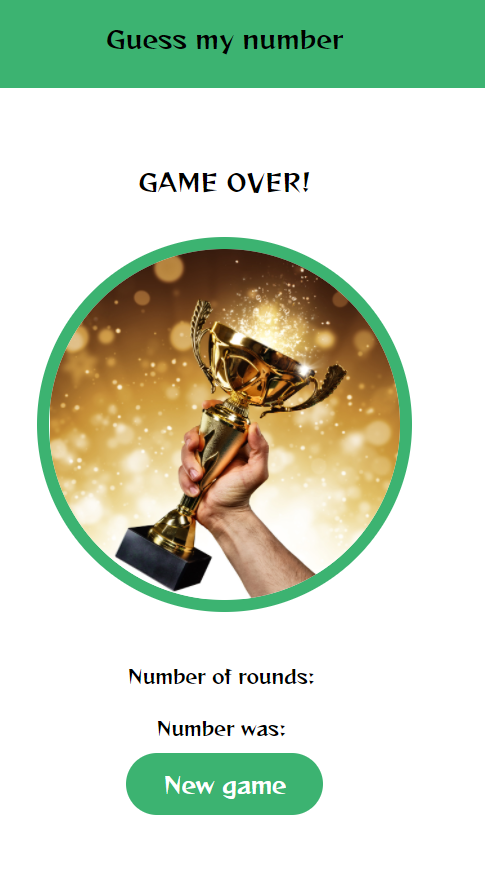

# Images

We have 2 ways to add images to our app:

1. Local images
2. Web images

### Bring image

Download image to `assets` folder



#### GameOverScreen.js

```js
import React from "react";
import { View, Text, StyleSheet, Button, Image } from "react-native";

import HeaderText from "../components/HeaderText";
import MainButton from "../components/MainButton";

const GameOverScreen = (props) => {
  return (
    <View style={styles.container}>
      <HeaderText>GAME OVER!</HeaderText>

      <Image source={require("../assets/win.jpeg")} style={styles.image} />

      <Text style={styles.txt}>Number of rounds: {props.roundsNumber}</Text>
      <Text style={styles.txt}>Number was: {props.userNumber}</Text>
      <MainButton onPress={props.restart}>New game</MainButton>
    </View>
  );
};

const styles = StyleSheet.create({
  container: {
    flex: 1,
    alignItems: "center",
    justifyContent: "center",
  },
  image: {
    width: "80%",
    height: 300,
    borderRadius: 300,
  },
  txt: {
    fontSize: 15,
    margin: 10,
    fontFamily: "reggae-one",
  },
});

export default GameOverScreen;
```

### Perfect cycle:

To get a perfect circle - container of the image must be a square. (width and height are the same).

- note: border-radius will be half of width/height.
- Note: using `overflow:hidden` - any part in child component that overlaps the View will be removed.

```js
import React from "react";
import { View, Text, StyleSheet, Button, Image } from "react-native";

import HeaderText from "../components/HeaderText";
import MainButton from "../components/MainButton";
import Colors from "../constants/Colors";

const GameOverScreen = (props) => {
  return (
    <View style={styles.container}>
      <HeaderText>GAME OVER!</HeaderText>

      <View style={styles.imageContainer}>
        <Image source={require("../assets/win.jpeg")} style={styles.image} />
      </View>

      <Text style={styles.txt}>Number of rounds: {props.roundsNumber}</Text>
      <Text style={styles.txt}>Number was: {props.userNumber}</Text>
      <MainButton onPress={props.restart}>New game</MainButton>
    </View>
  );
};

const styles = StyleSheet.create({
  container: {
    flex: 1,
    alignItems: "center",
    justifyContent: "center",
  },
  // To get perfect cycle: height + width must be the same
  imageContainer: {
    width: 300,
    height: 300,
    borderRadius: 150, // half of height/width
    borderWidth: 2,
    borderColor: Colors.primary,
    // any-child component that is bigger than that - will be removed
    overflow: "hidden",
    margin: 30,
  },
  image: {
    height: "100%",
    width: "100%",
  },
  txt: {
    fontSize: 15,
    margin: 10,
    fontFamily: "reggae-one",
  },
});

export default GameOverScreen;
```

## Web images:

```js
<View style={styles.imageContainer}>
  <Image
    // source={require('../assets/win.jpeg')}
    source={{
      uri: "https://www.findabusinessthat.com/blog/wp-content/uploads/2018/12/4e31f3d8575509930472e13c9d57b815.jpeg",
    }}
    fadeDuration={300}
    style={styles.image}
  />
</View>
```
